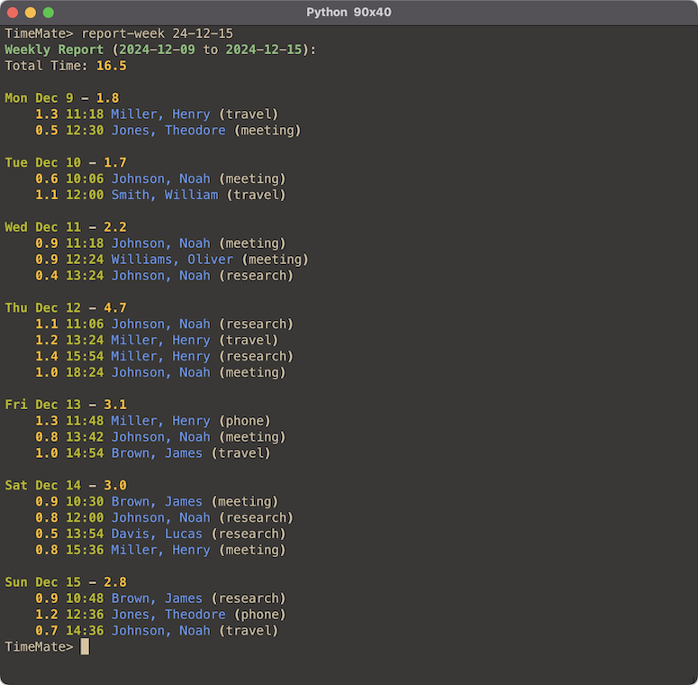
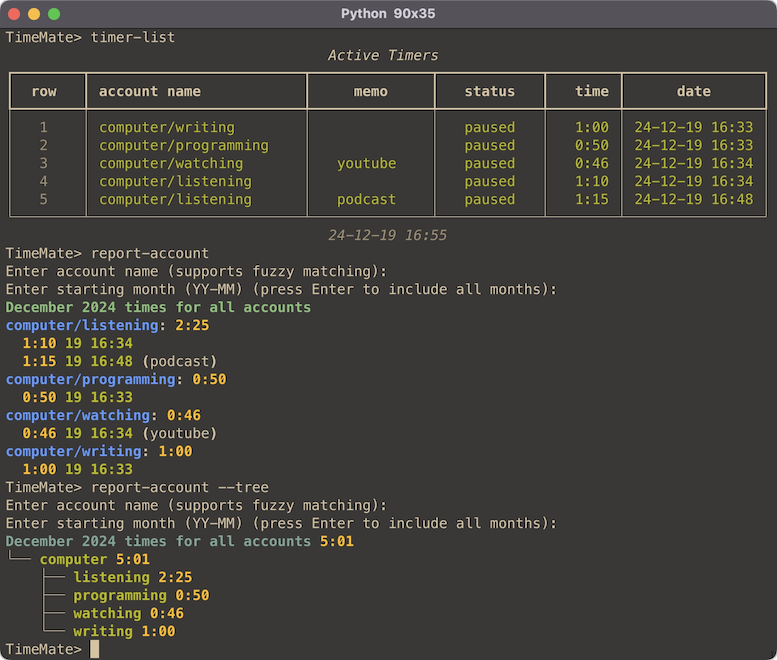

# TimeMate

This is the *TimeMate* user manual. It is best viewed at [GitHub.io](https://dagraham.github.io/timemate/).

*TimeMate* is intended to help you keep track of where your time goes. It provides both a CLI and Shell interface with methods for

- creating an *account*:  
The account could be the name of an *activity* or a *client* that occupies your time and for which a record would be useful.
- creating *timers* for an account:  
Each timer provides an option for entering a "memo" as well as the account name and provides a record of both the duration and the datetime for the time spent.
- listing, starting and pausing timers:  
When another timer is running, automatically pause the other timer, record time spent and then starts the new timer.
        
- reporting times spent. Times are aggregated by account and date and reported using the setting `MINUTES`. Here `MINUTES=6` which causes all times to be rounded up to the nearest 6 minutes or 1/10 of an hour.
  - by week:  
    times spent by day for a specified week for all accounts listed by day
    
  - by account:  
    times spent for specified account(s) and month(s) listed by month, account and day
    
  - by account tree:  
    aggregates of times spent for specified account(s) and month(s) in a tree diagram by month and account
    
- another example of times spent this time for *activities* instead of clients and with `MINUTES=1` which causes all times to be rounded up to the nearest minute and reported in hours and minutes. Note that with the '/' in the account names, the second parts of the names are treated as branches of the first part in the tree display.
    

## Installation

TimeMate can be installed from PyPi using either `pip install timemate` or, for personal use, `pipx install timemate`. For updates use either `pip install --force timemate` or `pip install -U timemate`.  It is also available from [GitHub](https://github.com/dagraham/timemate).

If the JSON file `~/timemate_config` exists and specifies a path for `TIMEMATEHOME`, it will be used as the home directory for TimeMate. Otherwise, if there is an environmental setting for `TIMEMATEHOME` then the path specified by that setting will be used. Finally, the directory `~/.timemate_home/` will be used as the home directory and created if necessary. The sqlite3 database, `timemate.db`, will be stored in this directory along with backup and log files.
